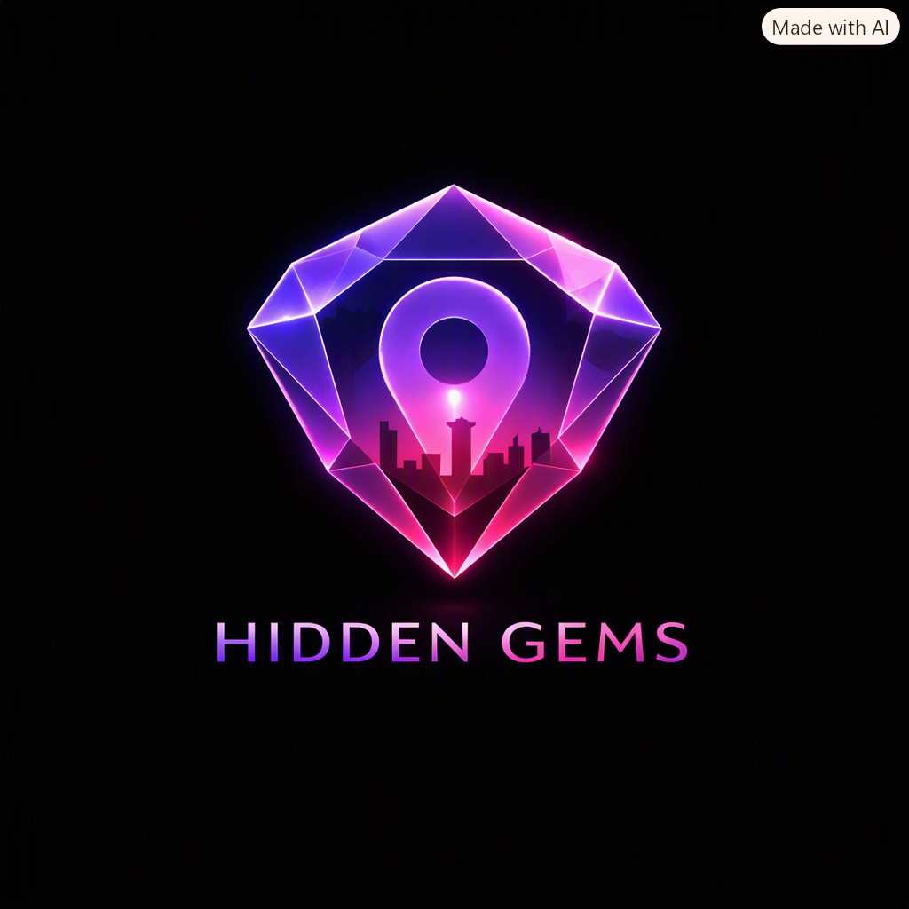

# Nairobi Hidden Gems

<p align="center">
  
</p>

Nairobi Hidden Gems is a discovery platform designed to help urban explorers find, save, and share aesthetic spots in Nairobi. From quiet study cafes to vibrant rooftop lounges and sunset viewpoints, the app curates the city's best-kept secrets with a "Dark Mode first" premium aesthetic.

## Vision & Aesthetic
The app follows a sleek, translucent, dark-themed design with vibrant purple and pink accents. It is built for the modern explorer who values vibes, high-quality photography, and community-driven recommendations.

## Completed Features
- **Splash Entry:** Smooth dark-themed transition featuring the premium brand identity.
- **Home Feed:** 
    - **Trending Section:** Real-time trending spots based on community interaction.
    - **Search & Filters:** Instant search by name/location and filtering by category (Cafe, Sunset, Study, Night).
    - **Live Grid:** Two-column visual layout with functional save/love interactions.
- **Authentication:** Integrated Firebase Authentication (Email/Password) with persistent sessions and secure registration validation.
- **Cloud Infrastructure:**
    - **Real-time Database:** Live Firestore integration with reactive UI updates using snapshot listeners.
    - **Media Pipeline:** Full Firebase Storage integration for persistent, global image hosting.
    - **Security:** Production-grade Firestore rules to protect user data and ensure integrity.
- **Community Contribution:** 
    - **Drop a Gem:** Functional form to add new spots with real image selection via system picker.
    - **Moderation:** Built-in "pending" status for new contributions to ensure content quality.
- **Interactive Details:** 
    - **Save & Organize:** Persist spots to personal collections.
    - **Interactive Rating:** Rate gems across Aesthetic, Chill, and Crowd metrics.
    - **Native Sharing:** System-level share sheet integration.
- **Explorer Profiles:** 
    - **Identity:** Support for custom display names, bios, profile pictures, and cover banners.
    - **Live Statistics:** Reactive counts for gems shared (Drops) and items saved.

## Tech Stack
- **Language:** Kotlin
- **UI Framework:** Jetpack Compose
- **Dependency Injection:** Hilt
- **Asynchronous Flow:** Kotlin Coroutines & StateFlow
- **Backend:** Firebase (Auth, Firestore, Storage)
- **Image Loading:** Coil
- **Architecture:** Clean Architecture with MVVM pattern.

## Project Structure
```text
nairobihiddengems/
├── core/               # Theme, navigation, and shared components
├── data/               # Repository implementations (Firebase, Mock)
├── domain/             # Business logic, models, and repository interfaces
├── ui/                 # UI components and ViewModels grouped by feature
│   ├── auth/           # Login & Registration
│   ├── home/           # Feed & Discovery
│   ├── details/        # Place details
│   ├── profile/        # User identity & settings
│   └── saved/          # Collections management
└── di/                 # Hilt Dependency Injection modules
```

## Getting Started
1. **Clone the repository:**
   ```bash
   git clone https://github.com/Elly739/nairobi-hidden-gems-.git
   ```
2. **Firebase Setup:**
   - Add your `google-services.json` to the `app/` directory.
   - Enable Email/Password Auth in the Firebase Console.
   - Configure Cloud Firestore and Firebase Storage.
3. **Run the Application:**
   - Open in Android Studio (Ladybug or newer).
   - Sync Gradle and deploy to a physical device (API 24+).

## Roadmap
- [ ] **Google Maps:** Direct integration for "Get Directions" and map-view exploration.
- [ ] **Social Features:** Comments, photo reviews, and following other gem hunters.
- [ ] **Reposts:** Allow users to share other hunters' gems to their own profile feed.
- [ ] **Offline Cache:** Support for browsing saved gems without an active connection.

---
*Created by Elly739 - Discover the Vibe of Nairobi.*
